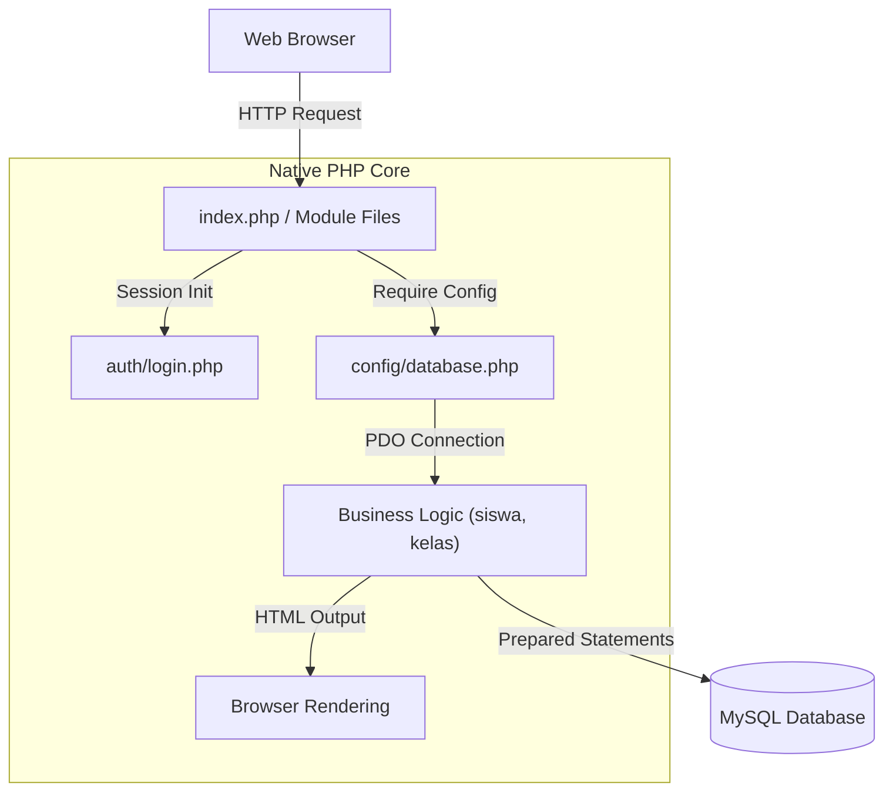
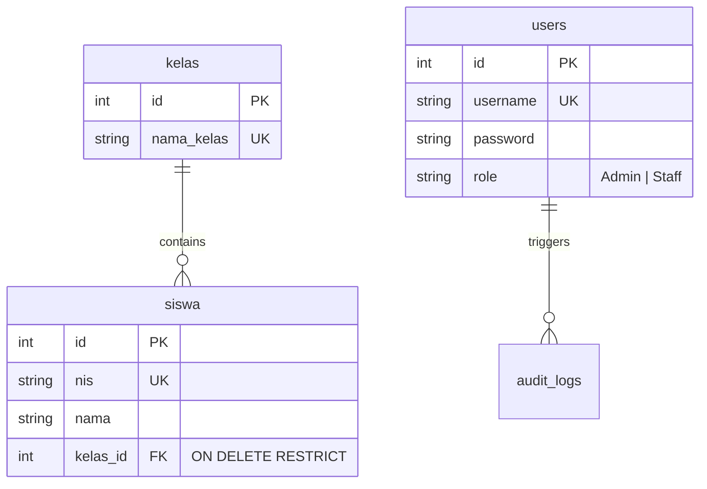

<div align="center">
  
  <br /><br />
  <a href="https://crud-akademik.vercel.app/">
    
  </a>
</div>

<p align="center">
  <a href="#"></a>
  <a href="#"></a>
  <a href="#"></a>
  <a href="#"></a>
</p>

---

## 📑 Table of Contents

- [About This Project](#-about-this-project)
- [Key Features](#-key-features)
- [Tech Stack](#-tech-stack)
- [Software Architecture](#-software-architecture)
- [Database Design](#-database-design)
- [Project Structure](#-project-structure)
- [Installation Guide](#-installation-guide)
- [Security Hardening Details](#-security-hardening-details)
- [Performance Optimization & Scalability](#-performance-optimization--scalability)
- [Development Workflow & Deployment](#-development-workflow--deployment)
- [Roadmap & Known Limitations](#-roadmap--known-limitations)
- [Lessons Learned](#-lessons-learned)
- [Contributing](#-contributing)
- [Why This Project Demonstrates Software Engineering Skills](#-why-this-project-demonstrates-software-engineering-skills)

---

## 🎯 About This Project

### Why This Project Exists
**CRUD Akademik** is a native PHP-based web application built to manage academic data efficiently. The primary focus of this project is demonstrating **Strict Database Integrity** and **Application Security** using raw PHP Data Objects (PDO) without the abstraction of modern ORMs.

### The Problem Being Solved
Many junior projects rely on application-level logic to prevent data deletion errors (e.g., PHP checking if a student exists before deleting a class). This is fundamentally unsafe as race conditions can occur. This project solves that by pushing the integrity constraints directly to the database layer.

### Business Value
- **Zero Data Orphans:** Utilizing pure SQL queries with `ON DELETE RESTRICT` constraints prevents orphaned records, ensuring that class data cannot be deleted if students are still enrolled.
- **High Performance:** Minimal overhead compared to heavy MVC frameworks.

---

## ✨ Key Features

### Core Operations
*   **Student & Class Management:** Complete Create, Read, Update, and Delete lifecycles for academic entities.
*   **Advanced Data Tables:** Features robust server-side data handling including pagination, multi-column search, and filtering.

### Security & Integrity
*   **Strict Relational Integrity:** Implements `ON DELETE RESTRICT` foreign keys. If an administrator attempts to delete a class (`Kelas`) that contains active students, the database actively rejects the query, preventing data corruption.
*   **Role-Based Access Control (RBAC):** Distinct dashboards and permissions for `Admin` (full access) and `Staff` (view/edit limited).

---

## 💻 Tech Stack

### Backend & Database
*   **Language:** PHP 8.x (Native)
*   **Database Engine:** MySQL 8.0 (InnoDB)
*   **Driver:** PHP Data Objects (PDO)

### Frontend
*   **Markup/Styling:** HTML5, CSS3, Bootstrap 5
*   **Interactivity:** Vanilla JS / jQuery

---

## 🏗️ Software Architecture

This project utilizes a **Modular Procedural Architecture**.



---

## 🗄️ Database Design

The schema leverages InnoDB features to enforce strict relational mapping.



---

## 📁 Project Structure

```text
├── assets/                  # CSS, JS, and UI images
├── auth/                    # Authentication logic
├── config/                  # Configuration (Database PDO Singleton)
├── database/                # SQL schema dumps
├── kelas/                   # Domain: Class management logic
├── siswa/                   # Domain: Student management logic
└── index.php                # Main dashboard entry point
```

---

## 🚀 Installation Guide

### 1. Requirements
*   PHP 8.0+
*   MySQL 8.0+

### 2. Clone the Repository
```bash
git clone https://github.com/B3rlinSugi/crud-akademik.git
cd crud-akademik
```

### 3. Database Setup
1. Create a MySQL database.
2. Import the SQL dump from the `database/` directory.

### 4. Configuration
Open the config file and update your MySQL credentials.

### 5. Run the Application
Place the folder inside `htdocs` or run PHP's built-in server:
```bash
php -S localhost:8000
```

---

## 🤝 Contributing
Contributions are welcome. Please read [CONTRIBUTING.md](CONTRIBUTING.md) for details.

---

## 📝 License
This project is licensed under the MIT License - see the [LICENSE](LICENSE) file for details.

---

## 👨‍💻 Author

**Berlin Sugiyanto**
*   Backend Developer | System Architect
*   [LinkedIn](https://linkedin.com/in/berlinsugi)

---

<br>

# 👔 Why This Project Demonstrates Software Engineering Skills

*A note for Technical Recruiters and Engineering Managers.*

1.  **Database Mastery:** Emphasizing `ON DELETE RESTRICT` at the SQL level rather than the application level demonstrates a deep understanding of Data Integrity and ACID principles.
2.  **Raw Security Understanding:** Properly utilizing PDO Prepared Statements for all operations proves that the developer doesn't just rely on framework magic to prevent SQL Injection, but fundamentally understands how the attack vectors operate and how to neutralize them manually.
